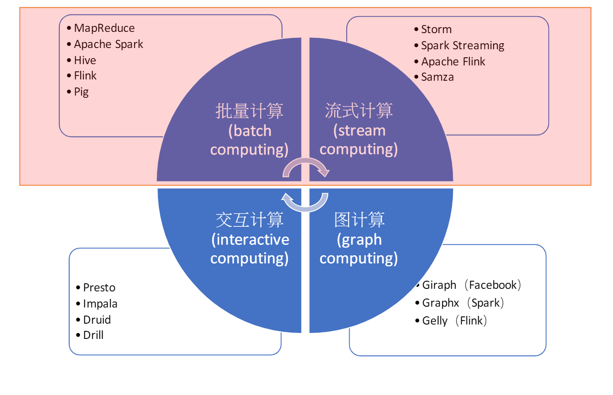
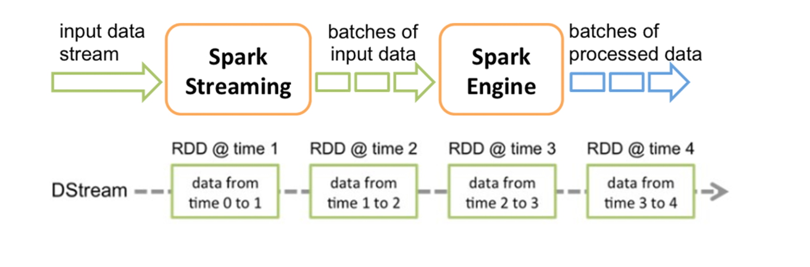
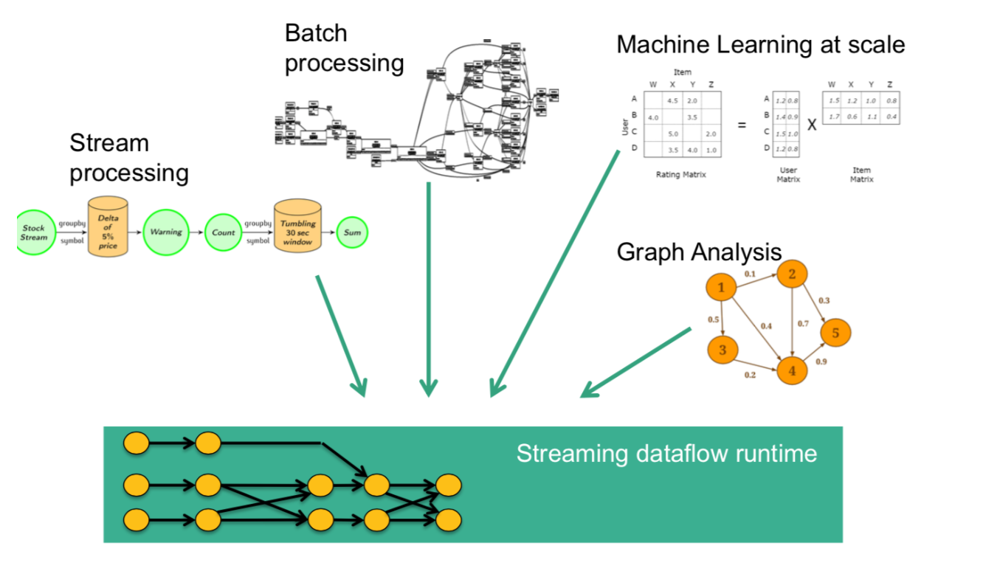
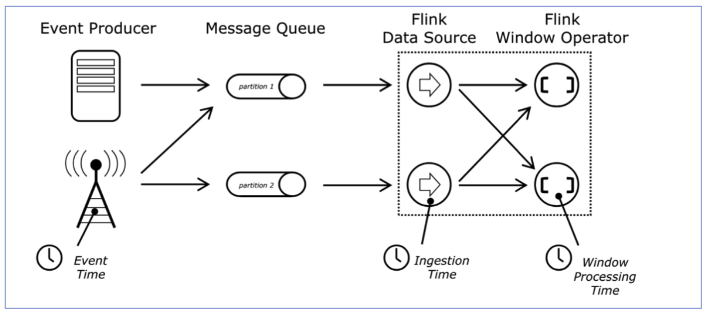
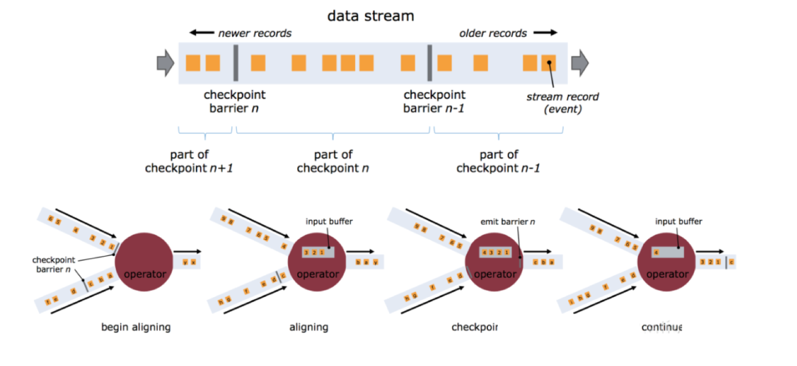
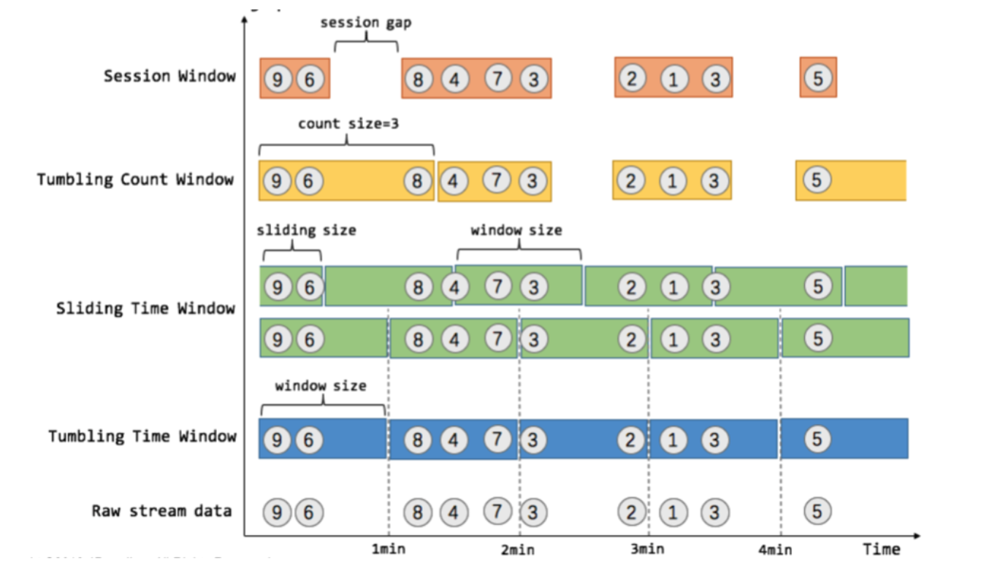
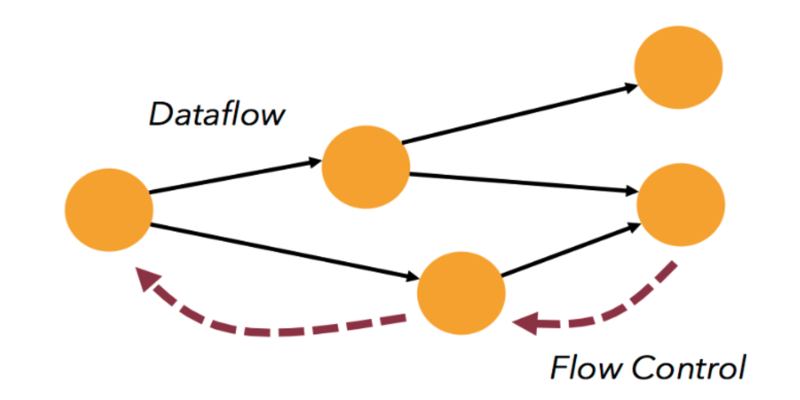

## 第一章 Apache Flink 基本介绍

### 大数据处理计算模式
1. 批量计算
2. 流式计算
3. 图计算
4. 交互计算

bigdatacalmode

### 流计算与批计算处对比
1. 数据时效性不同
   - 流式计算实时、低延迟，批量计算非实时、高延迟
2. 数据特征不同
   - 流式计算数据一般是动态、无边界，而批处理数据一般是静态数据
3. 应用场景不同
   - 流式计算应用在实时场景，时效性要求较高，如适时推进、业务监控。
   - 批量计算一般用于离线计算、数据分析、离线报表等
4. 运行方式不同
   - 流式计算的任务是持续进行的，批量计算的任务则是一次性完成

### 主流的流式框架
- Spark Streaming 属于Spark API扩展
- 以固定时间间隔处理一段段的批处理作业（即微批处理）
- 延迟性较高（秒级），但能搞保证消息传输既不丢失也不会重复
- 具有非常高的吞吐量

sparkstreamframe

- 真正的流处理框架
- 延迟性较低（毫秒级），且能够保证消息传输不丢失也不重复
- 具有非常高的吞吐量
- 支持原生流处理

### why flink?
- 低延迟
- 高吞吐
- 准确性
- 易用性

### 应用场景 实时数据仓库
1. 数据实时清洗、归并、结构化
2. 数仓的补充和优化

datacrash
 

### flink 核心特性
1. 统一数据处理组件栈，处理不同类型的数据要求（Batch，Stream，MachineLearning，Graph）

dataflow

2. 支持事件时间（Event Time），接入时间（Ingestion Time），处理时间（Processing Time）等时间概念

timeconception

3. 基于轻量级分布式快照（Snapshot）实现的容错

snapshot

4. 支持有状态计算
   - Support for very large state
   - queryable state 支持
   - 灵活的 state-backend（hdfs memory RocksDB）
  

statefulcal

5. 支持高度灵活的窗口（window）操作

window operation

6. 带反压（否反馈）的连续流模型

flow feedback with DAG

7. 基于JVM实现独立的内存管理
8. 应用可以超过主内存的大小限制，并且承受更少的垃圾收集开销
9. 对象序列化二进制存储，类似于C对内存的管理