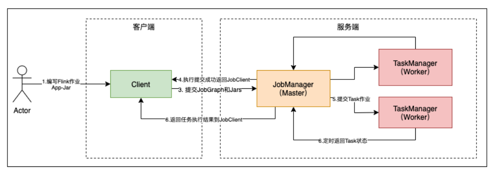
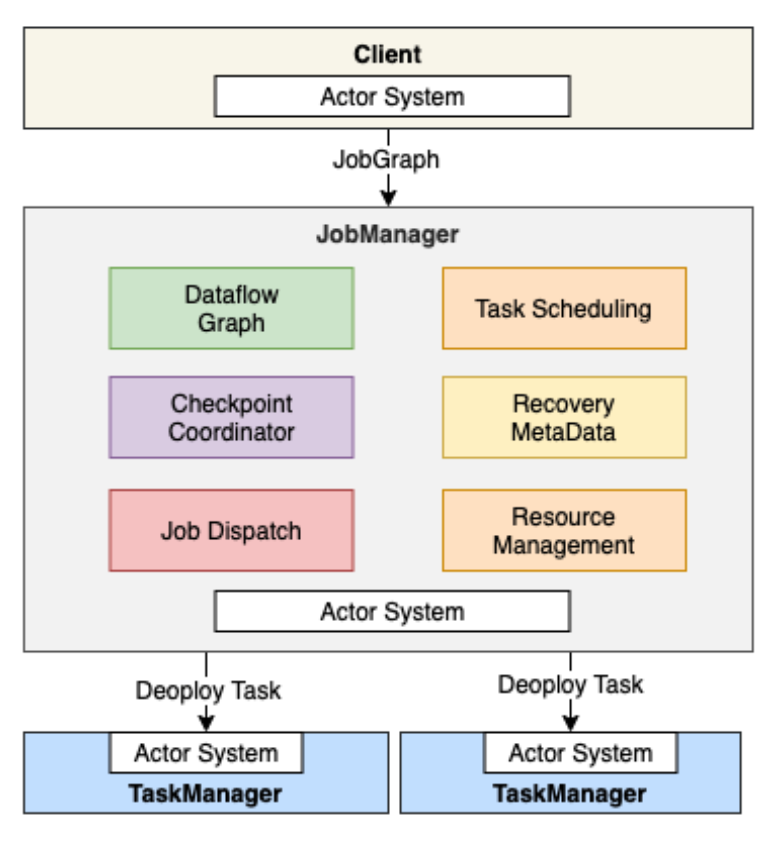
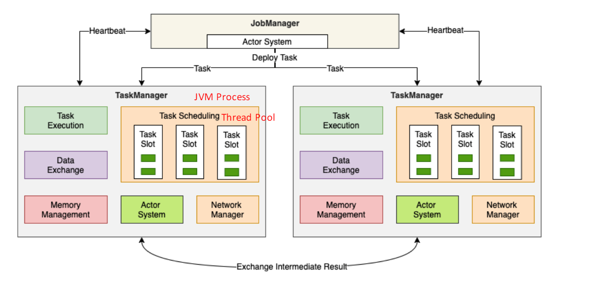
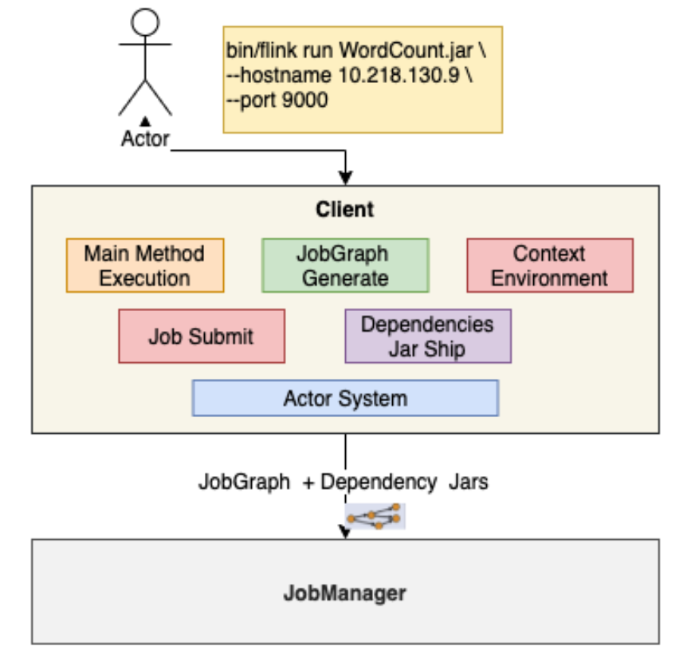
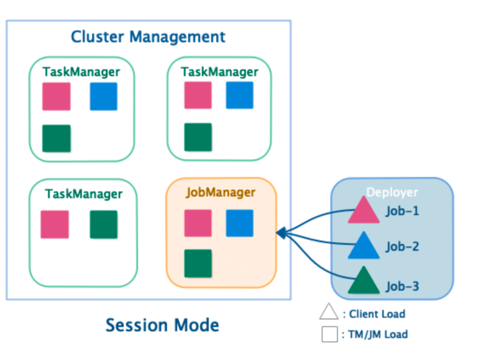
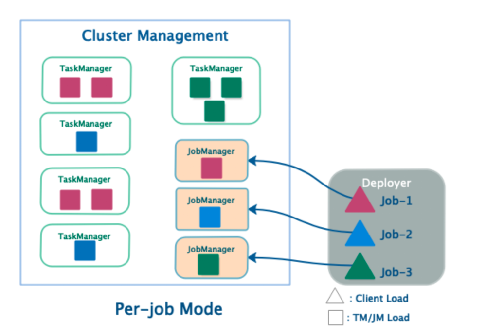
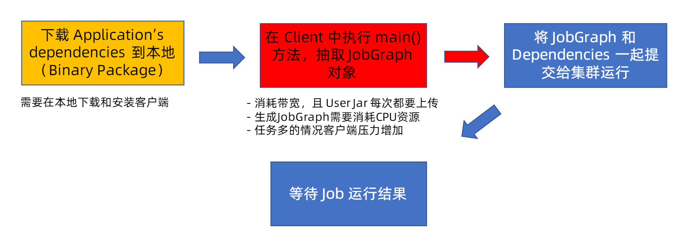
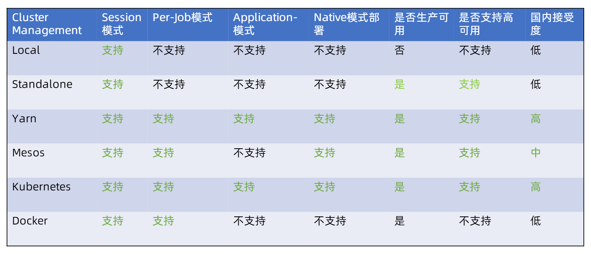

## 第二章 Flink 部署与应用

### Flink集群架构
- JobManager：管理节点，每个集群至少一个，管理整个集群的计算资源，Job管理与调度执行和checkpoint的协调
- Taskmanager：一个集群当中可以有一个或者多个TaskManager，复制提供计算资源
- Client：本地执行应用main（）方法解析JobGraph对象，并且最终将JobGraph提交到JobManager，同时监控job的执行状态
  

Job Flow

#### JobManager
- Checkpoint Coordinator 
- JobGraph -> Execution Graph
- Task调度与部署
- RPC通信（Actor System）
- Job接收（Job Dispatch）
- 集群资源管理（ResourceManager）
- TaskManager注册于管理
  

Job Manager Frame

#### TaskManager
- Task Execution 
- Network Manager
- Shuffle Environment
- RPC 通信
- Heartbeat with JobManager And ResourceManager
- Data Exchange
- Memory Management
- Register To ResourceManager
- offer Slots to JobManager

TaskManager Frame

#### Client 
- Application`s mai() method执行
- JobGraph Generate
- Execution Environment
- Job 提交和执行
- Dependeny Jar ship
- RPC with JobManager
- 集群部署（Cluster Deploy）

Client Frame

#### JobGrraph
- 通过有向无环图（DAG）表达用户程序
- 不同接口程序的抽象表达
- 客户端和集群之间的job描述载体
- 节点（Vertices），Restult参数

### Flink 集群部署模式

#### 集群部署模式对比
根据以下两种条件将集群部署模式分为三种类型：
1. 集群的生命周期和资源隔离
2. 根据程序main()方法执行在Client还是JobManager

- Session Mode
  - 共享JobManager和TaskManager，所有提交的Job都在一个Runtime中运行
- Per-Job Mode
  - 独享JobManager与TaskManager，为每个Job单独启动一个Runtime
- Application Mode（1.11版本提出）
  - Application的main()运行在cluster上而不是客户端
  - 每个Application对应一个Runtime，Application中可以含有多个Job

##### Session 集群运行模式
- Session集群运行模式
  - JobManager与TaskManager共享
  - 客户端通过RPC或RestAPI连接集群的管理节点
  - Deployer需要上传依赖的Dependences Jar
  - Deployer需要生成JobGraph，并提交到管理节点
  - JobManager的生命周期不受提交的Job影响

- Session运行模式的优点
  - 资源充分共享，提升资源利用率
  - Job在Flink Session集群中管理，运维简单
  
- Session运行模式的缺点
  - 资源隔离较差
  - 非Native类型部署，TaskManager不易拓展，Slot计算资源伸缩性较差

Session Mode

##### Per-Job 运行模式
- Per-Job类型集群
  - 单个Job独享JobManager与TaskManager
  - TaskManager中的Slot资源根据Job指定
  - Deployer需要上传依赖的Dependences Jar
  - 客户端生成JobGraph并提交到管理节点
  - JobManager的生命周期和Job生命周期绑定

##### Per-Job 部署模式的优势
- Job和Job之间资源完全隔离
- 资源根据Job需要申请，TaskManager Slots数量可以不同

##### PerJob 部署模式劣势
- 资源相对比较浪费，Jobmanager需要消耗资源
- Job管理完全交给CLusterManagement，管理复杂

Per-Job Mode

#### Session和Per-Job 部署模式的缺陷

Session and Per-Job Crack

为什么不直接把这些工作交给JobManager从而减轻客户端压力

后续等深入了解在探讨吧

### 集群资源管理器支持

#### Flink支持的资源管理器集群部署：
- Standalone
- Hadoop Yarn
- Apache Mesos
- Docker
- Kubernetes

#### Flink 集群部署对比

Cluster Managerment Compare

